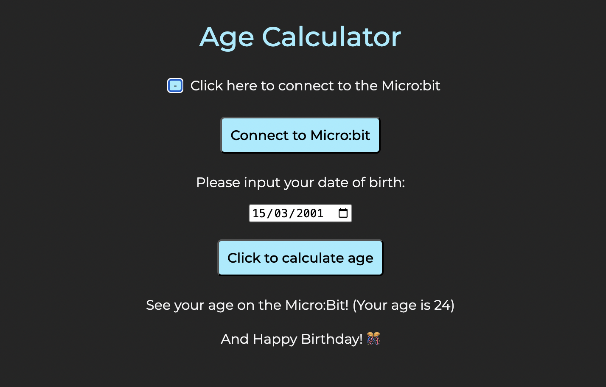

<h1 align="center">Age Calculator</h1>
 

  
&nbsp;&nbsp;&nbsp;&nbsp;&nbsp;&nbsp;Project Link: <a target="new" href="https://yuliia-kruta.github.io/age-calculator/">Live Demo</a>
    
  
<h2>Project description</h2>
This project is a simple age calculator that interacts with a <b>micro:bit</b> microcontroller via USB. The web interface allows users to enter their date of birth, calculates their age, and displays it both on the webpage and the micro:bit. If it's the user's birthday, the micro:bit plays a birthday song.

<h2>Features</h2>
<ul>
  <li>Web interface with a DOB input field and an age calculation button.</li>
  <li>Sends data via USB to the micro:bit for display. </li>
  <li>Displays a congratulatory message and plays a birthday song if it’s the user’s birthday.</li>
</ul>

<h2>Technologies Used</h2>

&nbsp Micro:bit 

<h2>Getting Started</h2>
To get a local copy up and running, follow these simple steps.

<h3>Prerequisites</h3>
Make sure you have a <b>Micro:bit</b> microcontroller and an account on  
<a href="https://makecode.microbit.org" target="_blank">MakeCode for micro:bit</a>. 

<h3>Installation</h3>
<h5>Clone or Download the repository:</h5>
<code>git clone https://github.com/Yuliia-Kruta/age-calculator.git</code>

<h5>Prepare your micro:bit:</h5>
Connect your micro:bit to the computer via USB. 
Log in to your MakeCode account and open the <code>microbit-Age-Calculator.hex</code> file there. 
Download the program onto micro:bit. 

<h5>Run the Web Interface:</h5>  
Open <code>index.html</code> in your browser.   
Click the <b>Connect</b> button to establish a connection with the micro:bit.  

<h2>How It Works </h2> 
- The user enters their DOB in the web interface and clicks "Calculate Age". 
- The script computes the age based on the current date.   
- If the input is valid, the age is sent to the micro:bit via USB.   
- The micro:bit displays the age and, if it’s the user's birthday, plays a birthday song.   
- Invalid inputs trigger an error message on both the web page and the micro:bit.  

<h2>License</h2>
Distributed under the MIT License. See LICENSE for more information.

